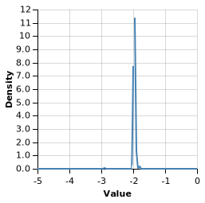
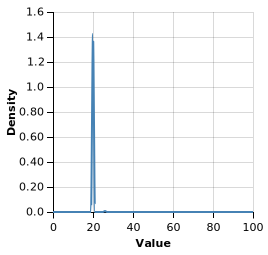

# WebPPL
[WebPPL](http://webppl.org) is a Probabilistic Programming Language, built over JavaScript. This repository contains gists written in WebPPL that highlight WebPPL's inference capabilities.

## Bayesian Regression
Bayesian regression allows us to estimate parameters as well as the probability density over the parameter space, conditional on training data.
See [bayesian_regression.js](bayesian_regression.js) to see how to perform Bayesian linear regression in WebPPL.  
In our example, when attempting to learn *y = -2x + 20*, we get the following densities over the slope (m) and intercept (c) in *y = mx + c* respectively, showing a good fit.

## References
* [Probabilistic Models of Cognition](https://probmods.org/)  
* [Modeling Agents with Probabilistic Programs](https://agentmodels.org/)  
* [The Design and Implementation of Probabilistic Programming Languages](http://dippl.org) by N. D. Goodman and A. Stuhlmüller.
